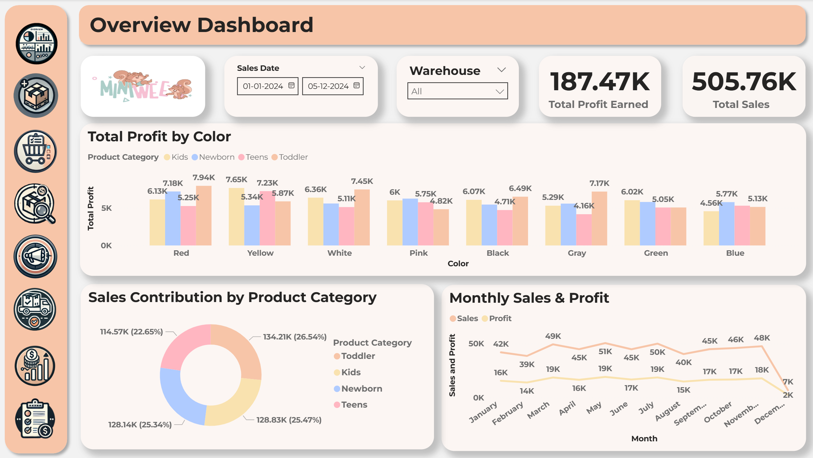
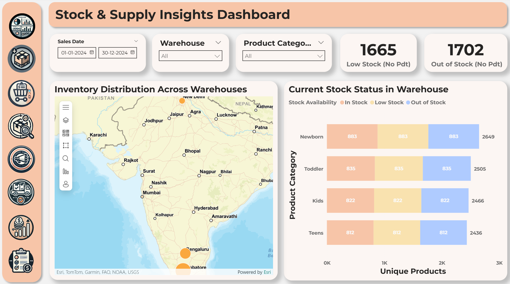
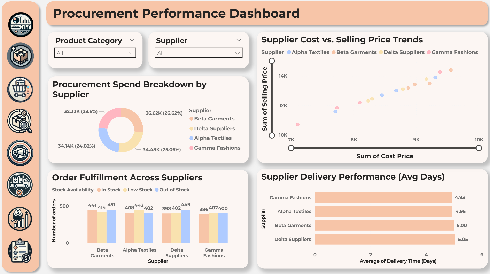
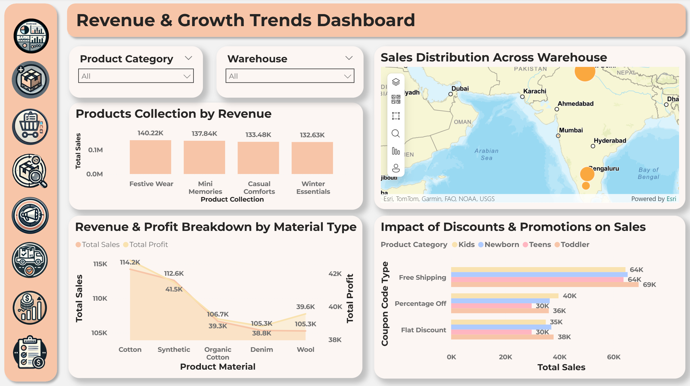
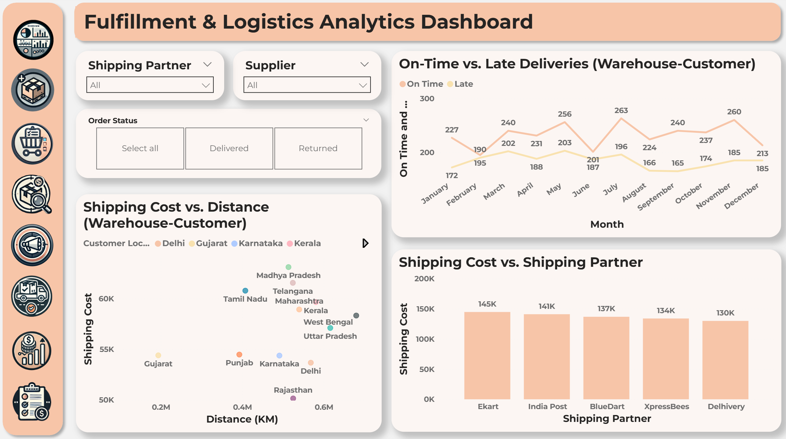
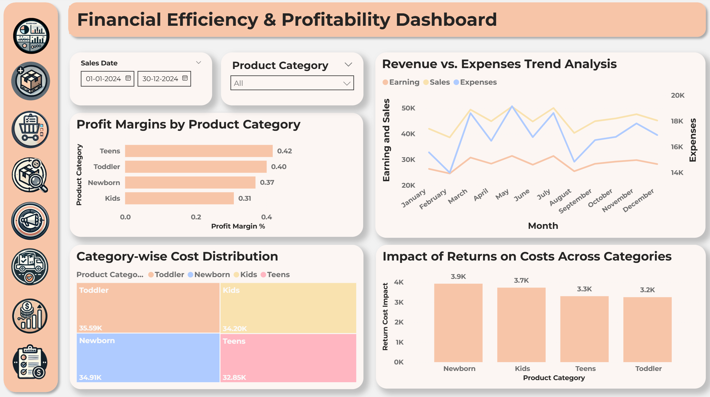

# Production & Inventory Monitoring Dashboard

## Project Overview

This project delivers a **multi-page interactive Power BI dashboard** designed for Miniwee, a growing online clothing brand. It consolidates data across production, inventory, procurement, revenue, logistics, and customer behavior into a unified intelligence platform — enabling leadership to move from reactive firefighting to proactive, data-driven decision-making. The dashboard surfaces critical KPIs, highlights supply chain bottlenecks, tracks financial performance, and monitors customer return patterns — all in real time through dynamic filters and slicers.

## Problem Statement

Miniwee faced a set of compounding operational challenges typical of fast-growing e-commerce brands:

- Manual inventory tracking using spreadsheets — error-prone, time-consuming, and unscalable
- Zero visibility into production lead times, supplier reliability, or stock aging
- Fragmented data across sales, logistics, procurement, and customer systems with no unified view
- Reactive decision-making — stockouts and overstock situations were identified only after significant financial damage
- No profitability lens — revenue was being tracked, but margin erosion from returns, logistics costs, and procurement inefficiencies went undetected

This project was built to solve exactly these problems.

## Objectives

- Design a centralized monitoring dashboard that integrates all operational verticals
- Enable real-time inventory visibility — stock levels, reorder points, aging inventory
- Surface procurement and supplier performance metrics to reduce dependency risks
- Track revenue, profit margins, and cost drivers at granular product/category levels
- Analyze logistics performance — delivery timelines, carrier efficiency, and regional fulfillment gaps
- Identify customer behavior patterns — return rates, repeat purchases, and segment-level profitability
- Provide actionable, self-service analytics to non-technical business stakeholders

## Dataset Description

| Attribute | Detail |
|---|---|
| **Source** | Internal operational data — Miniwee |
| **Volume** | 5,000+ records |
| **Features** | 40+ columns across multiple data domains |
| **Format** | Excel (.xlsx) |

### Data Domains Covered

| Domain | Description |
|---|---|
| Sales | Order volumes, revenue, discounts, payment modes, order dates |
| Inventory | SKU-level stock quantities, reorder levels, stock aging, warehouse locations |
| Production | Batch sizes, production timelines, yield rates, quality flags |
| Procurement | Supplier names, lead times, purchase costs, delivery performance |
| Logistics | Shipping carriers, delivery timelines, regional performance, return shipments |
| Customer Behavior | Customer segments, return rates, lifetime value, repeat purchase frequency |

## Tools & Technologies

| **Tool** | **Purpose** |
|---|---|
| Power BI Desktop | Dashboard design, visualization, and publishing |
| Power Query (M Language) | Data ingestion, transformation, and cleaning |
| DAX (Data Analysis Expressions) | KPI calculations, measures, and dynamic logic |
| Microsoft Excel | Raw data storage and initial preprocessing |

## Project Workflow

### Stage-by-Stage Breakdown

1. Data Collection
Raw operational data was sourced from Miniwee's internal Excel-based systems, covering all six data domains listed above.

2. Data Cleaning (Power Query)
Applied transformations including duplicate removal, null handling, data type standardization, column renaming, conditional column creation, and merging of related tables. Ensured referential integrity across all datasets before loading to the model.

3. Data Modeling (Star Schema)
Structured the model around a central Fact table (orders/transactions) linked to dimension tables for Products, Customers, Suppliers, Date, and Logistics. This schema optimized query performance and enabled clean DAX calculations.

4. DAX Calculations
Authored 20+ measures covering financial KPIs, operational ratios, and customer metrics — all dynamically responsive to slicer selections.

5. Dashboard Creation
Designed six purpose-built dashboard pages, each targeting a specific business function, with consistent visual language, branded color scheme, and intuitive navigation.

## Data Modeling

The data model follows a **Star Schema** architecture:

- Fact Table: Central transactions table containing order-level records (sales, quantities, costs, dates)
- Dimension Tables: Products, Customers, Suppliers, Date, Warehouse, Logistics — each linked to the Fact table via defined relationships
- Relationships: Implemented one-to-many relationships with single cross-filter direction to maintain calculation accuracy and prevent ambiguity
- Date Table: Custom-built using DAX CALENDAR() to enable full time intelligence (YTD, MoM, rolling periods)

This architecture ensures fast query performance, clean measure logic, and scalability as data volume grows.

## Dashboards Overview

### 1. Overview Dashboard
Provides an **executive-level summary** of the entire operation — total sales, profit, units sold, return rate, and top-performing categories — all filterable by date range, product category, and region. Designed as the landing page for leadership and non-technical stakeholders.

### 2. Inventory Dashboard
Monitors stock levels across all SKUs and warehouse locations, flags items below reorder thresholds, highlights aging inventory, and tracks stock turnover ratios. Enables procurement teams to act before stockouts occur.

### 3. Procurement Dashboard
Analyzes supplier performance, purchase costs, and lead time reliability. Surfaces dependency risks where a single supplier accounts for a disproportionate share of procurement volume. Helps sourcing teams negotiate and diversify supply chains.

### 4. Revenue Dashboard
Breaks down revenue by product, category, channel, and time period. Includes month-over-month growth trends, discount impact analysis, and contribution margin by product line — giving the finance team a granular view of what's actually driving revenue.

### 5. Logistics Dashboard
Tracks carrier performance, regional delivery timelines, and return shipment volumes. Identifies fulfillment bottlenecks by geography and highlights carriers with consistently high delivery delays or return ratios.

### 6. Profitability Dashboard
Delivers a margin-level deep dive — cost of goods sold, logistics costs, return costs, and net profit by product and segment. Surfaces unprofitable SKUs that appear to perform well on revenue but bleed margin when all costs are factored in.

##  Key Insights

- Overstock concentration: The top 3 SKUs accounted for a disproportionate share of excess inventory, tying up working capital
- Supplier concentration risk: Over 60% of procurement volume was routed through a single supplier, creating a significant supply chain vulnerability
- Return rate hotspots: Specific product categories exhibited return rates 2–3× the brand average, pointing to fit/quality issues requiring intervention
- Logistics inefficiency: One regional carrier consistently underperformed on delivery timelines, contributing to elevated customer dissatisfaction in those zones
- Hidden margin erosion: Several high-revenue SKUs were identified as margin-negative after accounting for returns and logistics costs
- Seasonal demand gaps: Inventory replenishment cycles were misaligned with demand peaks — causing simultaneous stockouts in top sellers and excess in slow movers

## Business Impact

| **Area** | **Estimated Impact** |
|---|---|
| Inventory Optimization | Potential 15–20% reduction in overstock carrying costs through improved reorder point management |
| Supplier Risk Mitigation | Identified over-reliance on single supplier; diversification can reduce procurement disruption risk |
| Margin Recovery | Flagged unprofitable SKUs driving an estimated 8–12% margin leakage when returns and logistics costs are included |
| Decision Speed | Replaced manual weekly reporting with real-time self-service dashboards, cutting reporting effort significantly |
| Logistics Cost Reduction | Carrier performance analysis creates a data-backed basis for renegotiation or carrier switching |

## How to Use

Prerequisites: [Power BI Desktop](https://powerbi.microsoft.com/desktop/) (free) must be installed.

1. Clone or download this repository
2. Open `Production_and_Inventory_Monitoring_Dashboard.pbix` in Power BI Desktop
3. If prompted, update the data source path to point to `/data/dataset.xlsx`
4. Use the slicers (date range, category, region) on each page to filter views
5. Navigate between the 6 dashboard pages using the page tabs at the bottom
6. Refer to `docs/project_report.pdf` for full methodology and DAX documentation

## Future Improvements

- Demand Forecasting: Integrate time-series forecasting models (Prophet, ARIMA) to predict future stock requirements and reduce manual replenishment guesswork
- Machine Learning Integration: Build ML models for return prediction and customer churn scoring using Python, surfaced via Power BI's Python visual support
- Real-Time Data Pipelines: Replace static Excel imports with automated pipelines (Azure Data Factory or Power Automate) for live operational data refresh
- Alert System: Configure Power BI Data Alerts to proactively notify procurement teams when stock falls below reorder thresholds
- Customer Segmentation: Apply RFM (Recency, Frequency, Monetary) clustering to enable more targeted marketing and retention strategies
- Cloud Deployment: Publish to Power BI Service with scheduled refresh and role-based access control for team-wide consumption

## Conclusion

This project demonstrates how a structured BI implementation — built on solid data modeling, rigorous ETL, and thoughtful visualization — can transform fragmented operational data into a competitive asset. For Miniwee, it replaced manual spreadsheet workflows with a scalable, self-service analytics platform that surfaces the right insights to the right stakeholders at the right time.

The methodologies applied here — star schema modeling, DAX measure design, multi-page dashboard architecture — are directly transferable to enterprise BI environments across retail, e-commerce, and supply chain domains.

